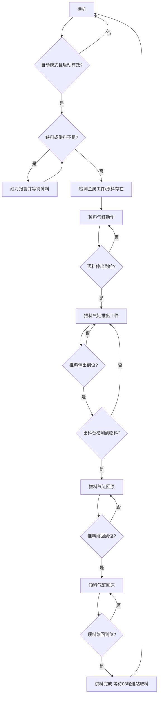

# 01供料站工艺流程图

主要信号依据：

- 输入：顶料伸出到位、顶料缩回到位、推料伸出到位、推料缩回到位、出料台物料检测、供料不足、缺料、金属工件检测
- 输出：顶料电磁阀、推料气缸、三色灯

```mermaid
flowchart TD
    A[待机] --> B{自动模式且启动有效?}
    B -- 否 --> A
    B -- 是 --> C{缺料或供料不足?}
    C -- 是 --> D[红灯报警并等待补料]
    D --> C
    C -- 否 --> E[检测金属工件/原料存在]
    E --> F[顶料气缸动作]
    F --> G{顶料伸出到位?}
    G -- 否 --> F
    G -- 是 --> H[推料气缸推出工件]
    H --> I{推料伸出到位?}
    I -- 否 --> H
    I -- 是 --> J{出料台检测到物料?}
    J -- 否 --> H
    J -- 是 --> K[推料气缸回原]
    K --> L{推料缩回到位?}
    L -- 否 --> K
    L -- 是 --> M[顶料气缸回原]
    M --> N{顶料缩回到位?}
    N -- 否 --> M
    N -- 是 --> O[供料完成 等待03输送站取料]
    O --> A
```

## 工艺理解

- 该站完成原料单件分离、顶升和推出。
- `出料台物料检测` 是本周期供料成功的重要确认信号。
- 供料不足、缺料应优先进入报警处理，不应继续顶料和推料。
