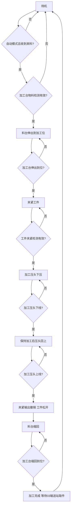

# 02加工站工艺流程图

主要信号依据：

- 输入：加工台物料检测、工件夹紧检测、加工台伸出到位、加工台缩回到位、加工压头上线、加工压头下线
- 输出：夹紧电磁阀、料台伸缩电磁阀、加工压头电磁阀、三色灯

```mermaid
flowchart TD
    A[待机] --> B{自动模式且收到来料?}
    B -- 否 --> A
    B -- 是 --> C{加工台物料检测有效?}
    C -- 否 --> A
    C -- 是 --> D[料台伸出到加工位]
    D --> E{加工台伸出到位?}
    E -- 否 --> D
    E -- 是 --> F[夹紧工件]
    F --> G{工件夹紧检测有效?}
    G -- 否 --> F
    G -- 是 --> H[加工压头下压]
    H --> I{加工压头下线?}
    I -- 否 --> H
    I -- 是 --> J[保持加工后压头回上]
    J --> K{加工压头上线?}
    K -- 否 --> J
    K -- 是 --> L[夹紧输出撤销 工件松开]
    L --> M[料台缩回]
    M --> N{加工台缩回到位?}
    N -- 否 --> M
    N -- 是 --> O[加工完成 等待03输送站取件]
    O --> A
```

## 工艺理解

- 该站核心顺序是：来料确认、料台到位、夹紧、下压加工、回上、退台。
- 若后续程序细化，建议把“加工保持时间”和“加工完成信号”做成参数。
