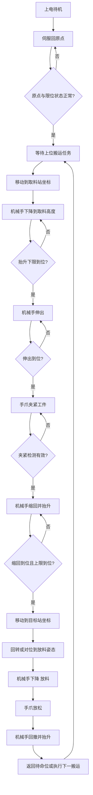

# 03输送站工艺流程图

主要信号依据：

- 输入：原点、左右限位、抬升上下限、旋转左右限、伸出缩回、夹紧检测、伺服报警
- 输出：脉冲、方向、抬升电磁阀、回转左右旋、手爪伸出、手爪夹紧、手爪放松

## 工艺理解

- `03输送站` 实际承担多站搬运任务，可拆成多个子任务：
- `供料站 -> 加工站`
- `加工站 -> 装配站`
- `装配站 -> 分拣站`
- 伺服报警和左右限位应在程序里优先级最高。
