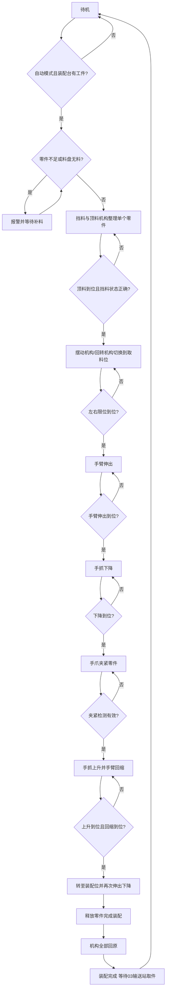

# 04装配站工艺流程图

主要信号依据：

- 输入：零件不足、零件有无、左右料盘零件检测、装配台工件检测、顶料到位/复位、挡料状态、落料状态、摆动气缸左右限、手爪夹紧、手爪下降/上升、手臂缩回/伸出
- 输出：挡料、顶料、回转、手爪夹紧、手抓下降、手臂伸出、三色灯、HL1/HL2/HL3

## 工艺理解

- 该站是“零件供给 + 抓取 + 对位 + 装配”复合工位。
- 由于 IO 里没有单独的“手爪放松”输出，流程图中把释放动作视为夹紧输出撤销。
