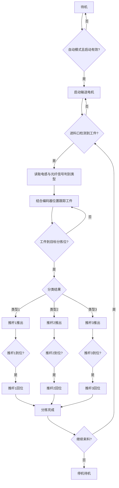

# 05分拣站工艺流程图

主要信号依据：

- 输入：编码器 A/B/Z 相、进料口工件检测、电感式传感器、光纤传感器、三路推杆到位、按钮与模式选择
- 输出：电机启动、三路推杆电磁阀、三色灯、模拟量输出

```mermaid
flowchart TD
    A[待机] --> B{自动模式且启动有效?}
    B -- 否 --> A
    B -- 是 --> C[启动输送电机]
    C --> D{进料口检测到工件?}
    D -- 否 --> C
    D -- 是 --> E[读取电感与光纤信号判别类型]
    E --> F[结合编码器位置跟踪工件]
    F --> G{工件到目标分拣位?}
    G -- 否 --> F
    G -- 是 --> H{分类结果}
    H -- 类型1 --> I[推杆1推出]
    H -- 类型2 --> J[推杆2推出]
    H -- 类型3 --> K[推杆3推出]
    I --> L{推杆1到位?}
    J --> M{推杆2到位?}
    K --> N{推杆3到位?}
    L -- 是 --> O[推杆1回位]
    M -- 是 --> P[推杆2回位]
    N -- 是 --> Q[推杆3回位]
    O --> R[分拣完成]
    P --> R
    Q --> R
    R --> S{继续来料?}
    S -- 是 --> D
    S -- 否 --> T[停机待机]
```

## 工艺理解

- 分拣依据主要来自传感器识别和编码器定位。
- `QW80` 模拟量输出可作为速度或执行器控制补充量，实际用途需要现场再确认。
