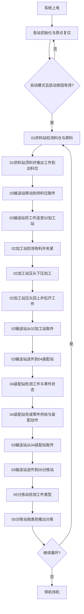

# 3358B整线总工艺流程图

以下流程根据 5 个站的 IO 功能综合推断，重点体现工艺顺序和站间交接关系。

## 站间主交接关系

- `01供料站 -> 03输送站`：供料完成、允许取料
- `03输送站 -> 02加工站`：到位放料、允许加工
- `02加工站 -> 03输送站`：加工完成、允许取件
- `03输送站 -> 04装配站`：到位放料、允许装配
- `04装配站 -> 03输送站`：装配完成、允许取件
- `03输送站 -> 05分拣站`：到位放料、允许分拣

## 说明

- `03输送站` 是整线节拍的核心搬运站。
- 总图没有展开手动、报警、复位分支，只保留主工艺路径。
